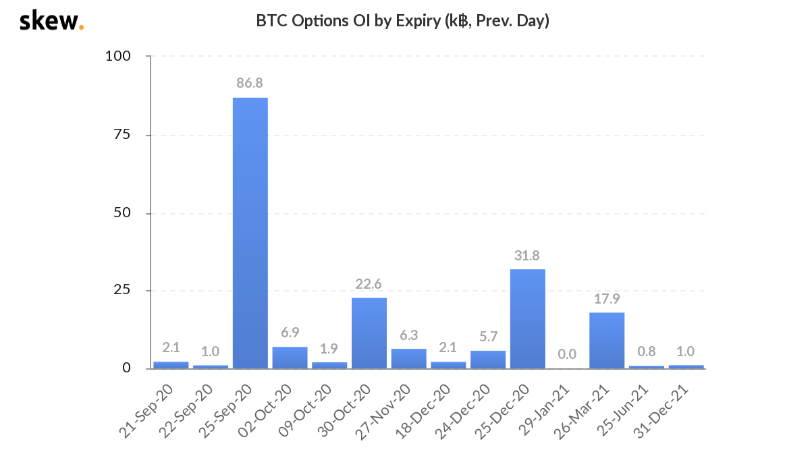
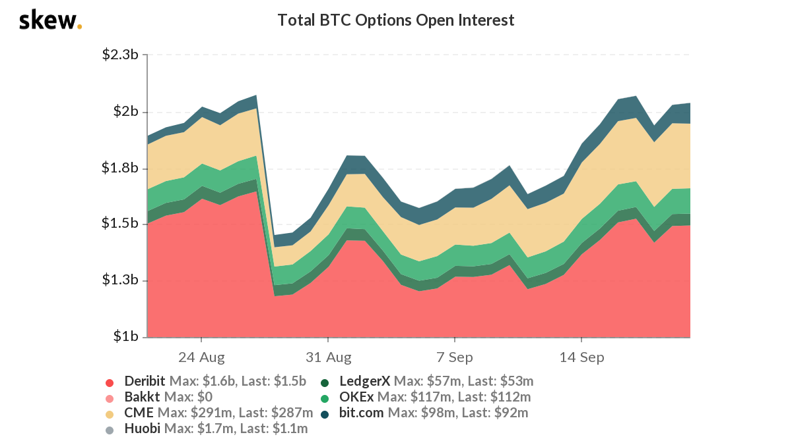

Cryptocurrency's option market continue to grow in the past month. The open interest of the coming monthly expiry BTC option is again at $1 billion level.


In the traditional financial system, it's very difficult (costy) for individual to acess the market data, nevertheless to say analyze and trade option in a way of institutional user. But the cryptocurreny option market is open for everyboday, we can easily subcribe to realtime market data and programatically trade option with open API provided by all crypto exchanges.

### Choose Database
As a first step, I'll try to use Python to subscribe realtime market data and persist into localdisk (to the cloud in the later post), so it can be used for analytic research. To store the data, we need to find out a proper database, which should have below characteristics:
* Efficiency - enpower fast query in large scale
* Scalbility - easy to scale up, efficient compression support to save disk usage
* Interoperability - support access by different language or different platform

By its nature time series data is columnar, [KDB+](https://kx.com/) is one of the best solution to work with. It is a fast database which also enables you to query and manipunate data in memory using its own language [Q](https://code.kx.com/q/). However KDB+ is not open source, it can only be used for non-comercial purpose for free. Thanks to Saeed who has compared several state of the art [time series database in his post](https://www.cuemacro.com/2019/02/02/storing-time-series-data/). Based on that, we decide to combine [Apache Parquet](https://parquet.apache.org/) as the storage format, [Apache Arrow](https://arrow.apache.org/) as the memory format and [PyArrow](https://arrow.apache.org/docs/python/) as the processing engine.

### Subscribe Market Data
From below statistic, Deribit is the most active exchange for BTC option, so I'll start with Deribit API to subscribe the market data. 

As it is public data, we don't even need to create a account. In this post, we'll need three APIs which are:
```
public/get_instruments
public/set_heartbeat
public/subscribe
```

### Persist Market Data
```python
import pyarrow.parquet as pq
```


### Others
* [Reducing Python String Memory Use in Apache Arrow 0.12](https://arrow.apache.org/blog/2019/02/05/python-string-memory-0.12/)